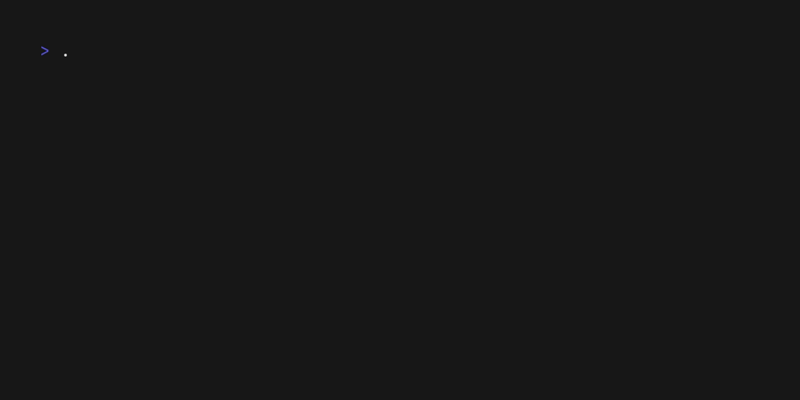

# contrib

< insert description >

> Update the above demo gif by running `make vhs`
> Details in the demo are defined in [demo.tape](demo.tape). See section further down for the details.

# First Steps

1. Run `go mod tidy` to install dependencies
2. Run `make build` to compile the binary and verify it works. It should be available under `dist/contrib`. Run it by calling `dist/contrib` in the terminal, it should print out the help details.
3. Develop your app

# Makefile targets

The following commands are available in the Makefile:

| Target      | Description                                                           |
|-------------|-----------------------------------------------------------------------|
| build       | Build the application binary and place it in the `dist` directory     |
| clean       | Remove build artifacts and temporary files                            |
| test        | Run all tests                                                         |
| lint        | Run linting checks using golangci-lint                                |
| vhs         | Generate demo.gif using VHS in a Docker container                     |

# GitHub Config

## GitHub Workflows

The following GitHub workflows are configured for this project:

| Workflow    | Description                                                           |
|-------------|-----------------------------------------------------------------------|
| CI          | Runs tests and linting on every push and pull request                 |
| Dependency Review | Scans dependencies for license compliance issues on pull requests |
| Gitleaks    | Scans for secrets in the repository on pull requests                  |
| Lint        | Runs lint checks on pull requests                                     |
| Release     | Creates a new release when a tag matching `v*` is pushed.             |

The workflows are defined in `.github/workflows` directory. Each workflow is triggered by specific events:

- **CI Workflow**: Runs on every push and pull request to ensure code quality
  - Runs unit tests
  - Performs linting checks
  - Builds the application

- **Dependnecy Review**: Runs on every pull request
  - Scans all dependencies are matches their license against an allow list
  - Configured in `.github/dep-review-conf.yml`

- **Gitleaks**: Runs on every pull request
  - Scans the repository for secrets

- **Lint**: Runs on every pull request
  - Runs linting checks using golangci-lint
  - Uses the configuration file `.golangci-lint.yml`

- **Release Workflow**: Triggered when a tag is pushed
  - Starts by running linting step to validate the code
  - Uses Goreleaser, configured in `.goreleaser.yaml`
  - Creates a new GitHub release
  - Builds and attaches binaries for multiple platforms
  - Generates checksums for the binaries
  - Generates an SBOM for each binary
  - Publishes changes to Homebrew for both macOS and Linux. See homebrew section below for more details on how to configure

## Set up automated homebrew publishing

This will allow you to automatically publish a new version to homebrew each time you push a new tag to github.

### homebrew repo

To use this you need to create a new homebrew tap. This is a public github repo that will contain the formula / casks
for your application.  The name of the repo should follow the convention `<github_username>/homebrew-tap`.  For example,
if your github username is `twinsnes`. then the repo name should be `twinsnes/homebrew-tap`.

### Access

Create a new PAT token with `content` write access to the homebrew tap repo and store the key as a secret in your github
repo. This is required so the github action that is building the application can push the new version to the homebrew tap.

Secret name: `TAP_GITHUB_TOKEN`

# Demo as code using VHS

You can automatically creat a demo gif of your cli application using (VHS by charmbracelet)[https://github.com/charmbracelet/vhs].
VHS is a tool that allows you to define user input as file and then record a terminal session. This can then be shared
as a gif. This makes it incredibly easy to update your demo as you make changes to your application.

The demo is defined in [demo.tape](demo.tape).  You can update the demo by modifying this file and then running `make vhs`.

We run VHS as a docker container, so we don't have to install dependencies like chromium on our local system. All the
steps required are defined in the `Makefile`.

---
This app was scaffolded using [cligen](https://github.com/twinsnes/cligen) ❤️